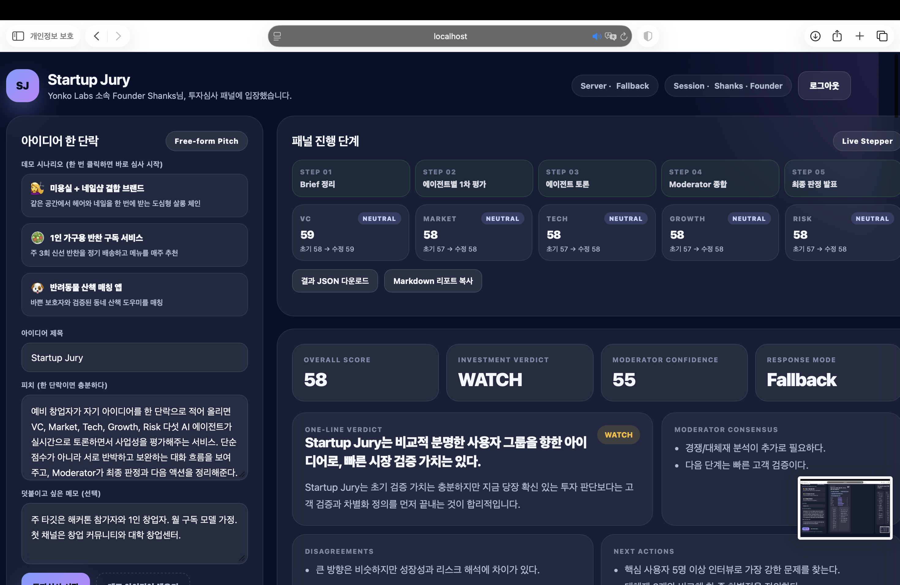
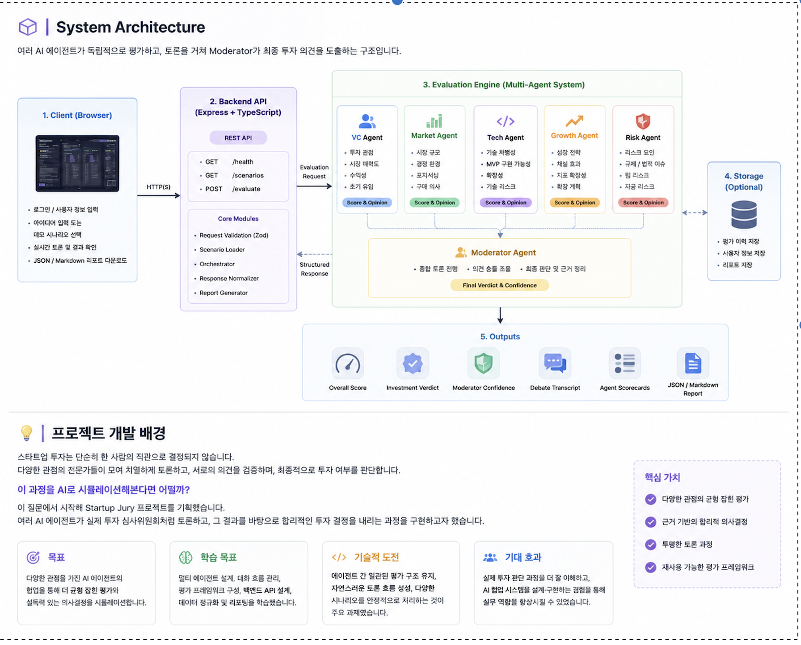
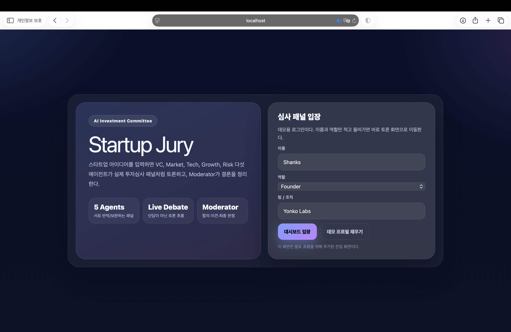
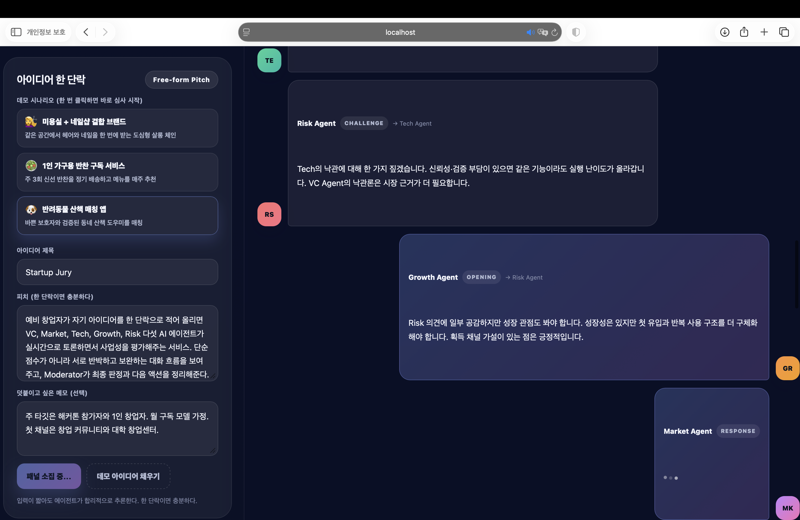
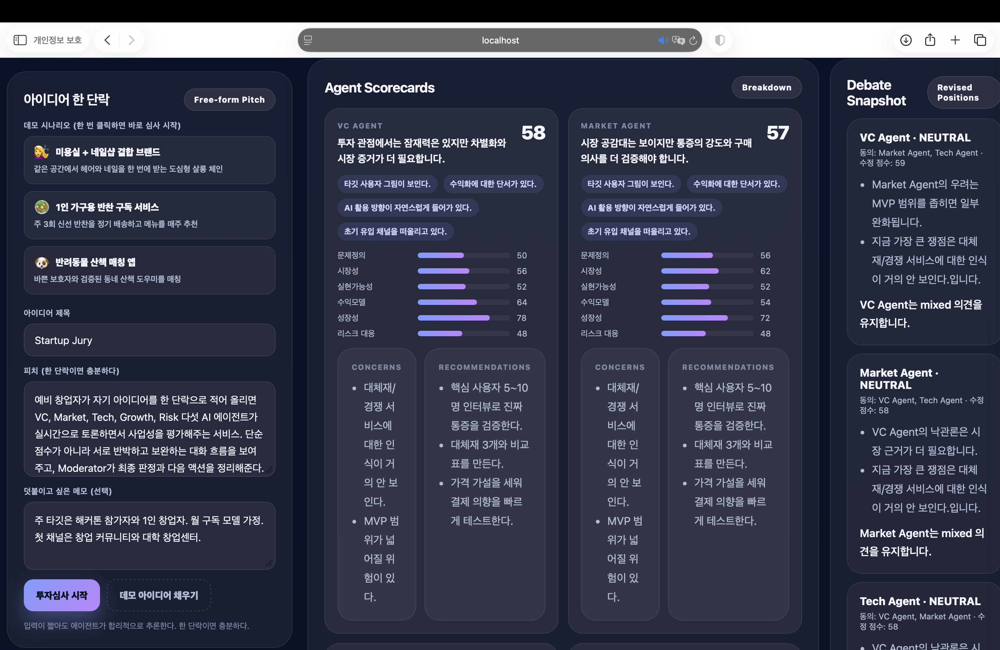
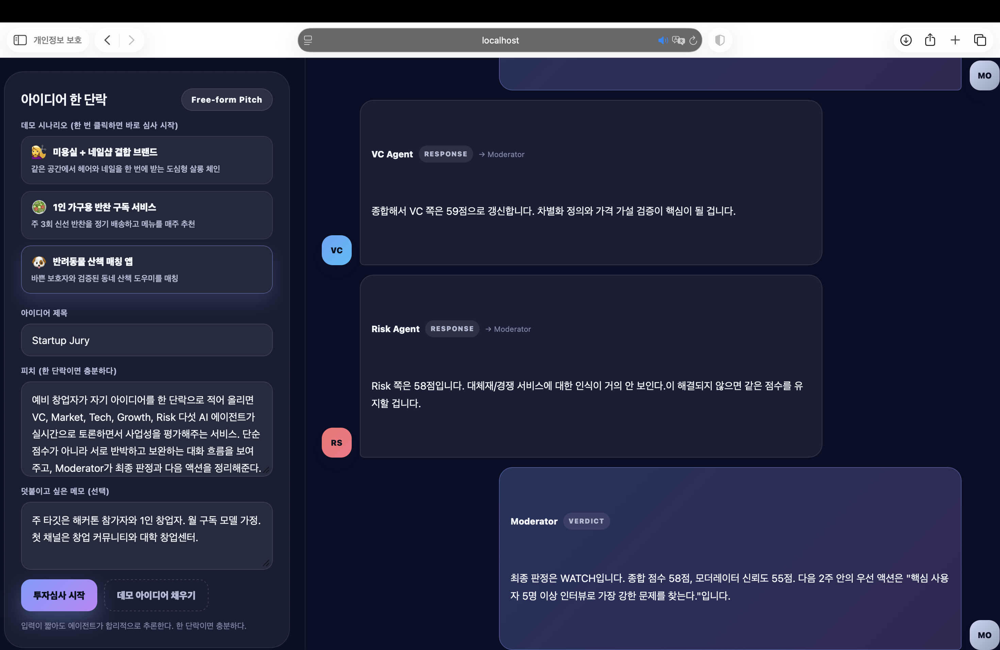

# Startup Jury

> AI-powered multi-agent startup investment committee simulator.

🇰🇷 Korean documentation is available in [README.ko.md](README.ko.md).

---

* TypeScript
* Node.js
* Express
* Zod
* Multi-Agent
* Hackathon Project

## Preview



## Overview

Startup Jury is a web-based demonstration platform that simulates how an investment committee evaluates startup ideas.

Instead of producing a single AI response, the application models multiple AI reviewers with different perspectives (VC, Market, Tech, Growth, and Risk). Each agent provides an independent evaluation, participates in a structured debate, and contributes to a moderator's final investment recommendation.

The project was built as a demonstration of multi-agent interaction, conversational UI, and startup evaluation workflow.

---

## Demo


### Workflow

1. Login
2. Submit a startup idea
3. Multi-agent evaluation begins
4. Live investment committee debate
5. Moderator summarizes the discussion
6. Final investment verdict
7. Export evaluation report

---

> **Project Type**: Hackathon Project  
> **Development Period**: May 2026  
> **Architecture**: Multi-Agent AI Simulation  
> **Backend**: TypeScript + Express  
> **Frontend**: HTML / CSS / JavaScript

## 📖 Project Background

Startup investment decisions are rarely made by a single person.

In real investment committees, venture capitalists, market analysts, technical reviewers, and risk specialists examine the same startup from different perspectives. They discuss their opinions, challenge each other's assumptions, and eventually reach a collective decision.

This project started from a simple question:

> **"What if we could simulate an investment committee using multiple AI agents instead of a single AI response?"**

Rather than generating only one evaluation, Startup Jury models several specialized AI reviewers that independently analyze a startup idea, participate in a structured discussion, and produce a moderator's final investment recommendation.

The goal of this project is not to replace professional investors, but to demonstrate how **multi-agent collaboration**, **structured reasoning**, and **conversational interfaces** can create a more transparent and explainable decision-making process.

## 💡 Why Multi-Agent?

Traditional AI evaluators generate a single response, making it difficult to understand how different perspectives influence the final decision.

Startup Jury adopts a multi-agent approach where each AI reviewer focuses on a different aspect of a startup.

This makes the evaluation process more transparent, encourages structured debate, and produces a moderator summary that reflects multiple viewpoints instead of a single opinion.

## Architecture



The backend coordinates multiple AI agents, aggregates their evaluations through the Moderator, and generates the final investment report.

## Features

User Idea
      │
      ▼

 VC
 Market
 Tech
 Growth
 Risk

      │

 Debate

      │

 Moderator

      │

 Final Verdict

---

### Live Debate Simulation

Instead of displaying independent reviews only, the agents participate in a conversational discussion.

The debate progresses through multiple stages before reaching a moderator decision.

---

### Moderator Consensus

A moderator summarizes

- agreements
- disagreements
- overall confidence
- final recommendation

---

### Investment Dashboard

The interface includes

- Overall Score
- Investment Verdict
- Moderator Confidence
- Step Progress
- Agent Scorecards
- Debate Timeline

---

### Demo Scenarios

Built-in demo scenarios allow quick demonstrations without manual input.

Examples include

- OneSeat Salon
- OneBite Box
- PawWalk

---

### Report Export

Evaluation results can be exported as

- JSON
- Markdown

---

## Screenshots

### Login



---

### Dashboard


---

### Live Debate



---

### Agent Scorecards



---

### Final Verdict



---

## Tech Stack

![TypeScript]
![Node.js]
![Express]
![Zod]

---

## Project Structure

```
src/
 ├── server.ts
 ├── agents.ts
 ├── llmEvaluator.ts
 ├── fallbackEvaluator.ts
 ├── normalize.ts
 ├── schema.ts
 ├── scenarios.ts
 ├── config.ts
 ├── types.ts
 └── utils.ts

public/
 └── index.html
```

---

## Getting Started

### Clone

```bash
git clone https://github.com/cynkai/startup-jury.git
cd startup-jury
```

### Install

```bash
npm install
```

### Development

```bash
npm run dev
```

Open

```
http://localhost:4000
```

---

## API

### Health Check

```
GET /health
```

---

### Demo Scenarios

```
GET /scenarios
```

---

### Startup Evaluation

```
POST /evaluate
```

---

## Future Improvements

- LLM integration
- Persistent evaluation history
- User authentication
- PDF export
- Investor profile customization
- Real-time streaming responses
- Docker deployment
- Cloud deployment

---

## What this project demonstrates

This project demonstrates

- Multi-agent workflow design
- Backend API development
- Conversational interface design
- TypeScript backend architecture

---

## License

MIT License
